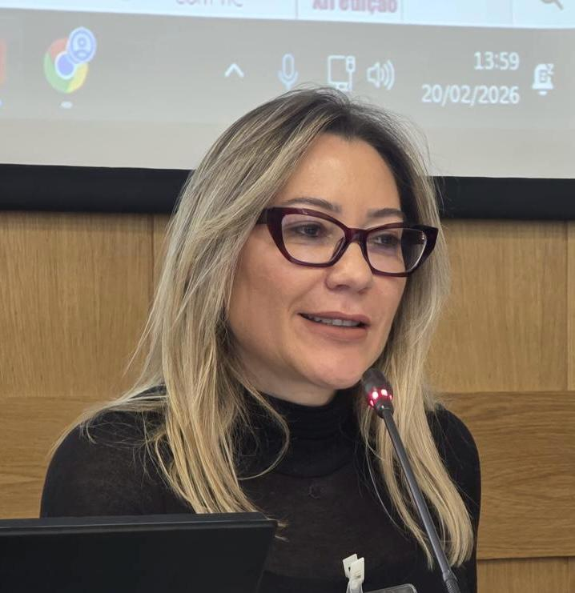

Professora Dra. Josimayre Novelli - Coordenadora do MULTIEDU

Possui graduação em Letras Português Inglês pela Universidade Estadual de Maringá (2002). Especialista em Ensino de Línguas Estrangeiras pela Universidade Estadual de Londrina (2007). Mestre em Estudos da Linguagem e Formação de professores pelo curso de pós-graduação da Universidade Estadual de Londrina (2008). Doutora em Estudos da Linguagem e Formação de Professores na Universidade Estadual de Londrina (2015). Pós-doutorado NAPI- UaB - Portugal. É professora de Língua Inglesa do Departamento de Letras Modernas da Universidade Estadual de Maringá  UEM e professora do Programa de Pós-graduação em Letras  UEM. Foi coordenadora institucional do Programa O Paraná Fala Idiomas e coordenadora da Universidade Aberta do Brasil (UAB)  UEM. Diretora do Núcleo de Educação a Distância (2018-2022). Presidente do Fórum das Licenciaturas da Uem (2021-2023). Tem experiência na área de ensino de língua inglesa no ensino Fundamental, Médio e Superior.  Coordenadora do Programa de Pós-graduação em Letras (PLE) (2023-2025). Atualmente é coordenadora do Programa Institucional de Bolsas de Iniciação à Docência (PIBID-Inglês) (2022-atual); Coordenadora do Projeto de Extensão "Laboratório Integrado de Letramentos Acadêmico-Científicos - LILA. Desenvolve pesquisas em ensino e aprendizagem de língua inglesa atuando principalmente na área da leitura crítica, letramento crítico, Cognição, formação de professores e tecnologias digitais (TDIC). Coordenou o projeto de pesquisa intitulado LETRAMENTOS DIGITAIS: perspectivas teórico-metodológicas no ensino e aprendizagem e na formação docente. Atualmente, coordena o projeto de pesquisa "Multiletramentos no ensino-aprendizagem-avaliação de línguas e na educação de professores.

---

### Outras Informações
Texto normal aqui embaixo.